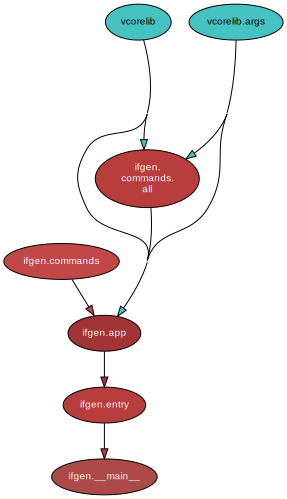

<!--
    =====================================
    generator=datazen
    version=3.1.3
    hash=f027a094d4c73ea1fc44e8d63edcf8db
    =====================================
-->

# ifgen ([1.1.0](https://pypi.org/project/ifgen/))

[](https://pypi.org/project/ifgen/)

[](https://codecov.io/github/vkottler/ifgen)


*An interface generator for distributed computing.*

## Documentation

### Generated

* By [sphinx-apidoc](https://vkottler.github.io/python/sphinx/ifgen)
(What's [`sphinx-apidoc`](https://www.sphinx-doc.org/en/master/man/sphinx-apidoc.html)?)
* By [pydoc](https://vkottler.github.io/python/pydoc/ifgen.html)
(What's [`pydoc`](https://docs.python.org/3/library/pydoc.html)?)

## Python Version Support

This package is tested with the following Python minor versions:

* [`python3.11`](https://docs.python.org/3.11/)

## Platform Support

This package is tested on the following platforms:

* `ubuntu-latest`
* `macos-latest`
* `windows-latest`

# Introduction

# Command-line Options

```
$ ./venv3.11/bin/ig -h

usage: ig [-h] [--version] [-v] [-C DIR] {gen,noop} ...

An interface generator for distributed computing.

options:
  -h, --help         show this help message and exit
  --version          show program's version number and exit
  -v, --verbose      set to increase logging verbosity
  -C DIR, --dir DIR  execute from a specific directory

commands:
  {gen,noop}         set of available commands
    gen              generate interfaces
    noop             command stub (does nothing)

```

# Internal Dependency Graph

A coarse view of the internal structure and scale of
`ifgen`'s source.
Generated using [pydeps](https://github.com/thebjorn/pydeps) (via
`mk python-deps`).


